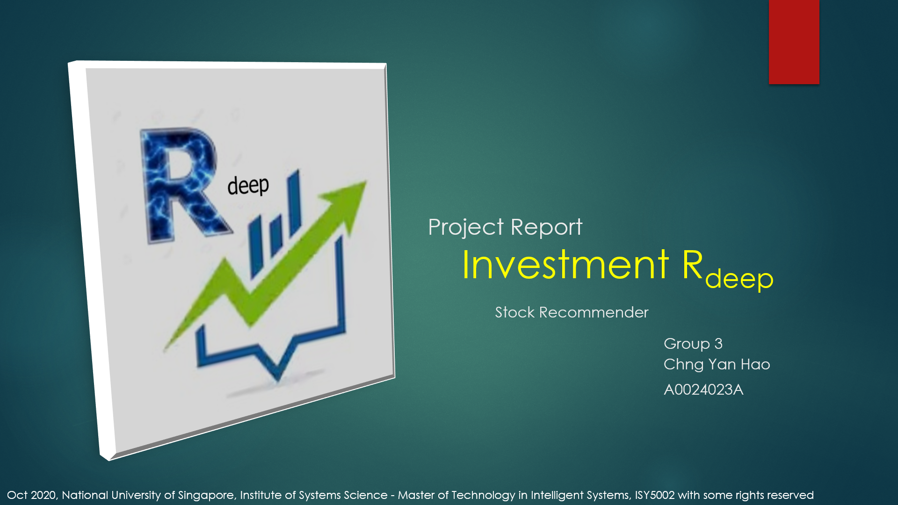
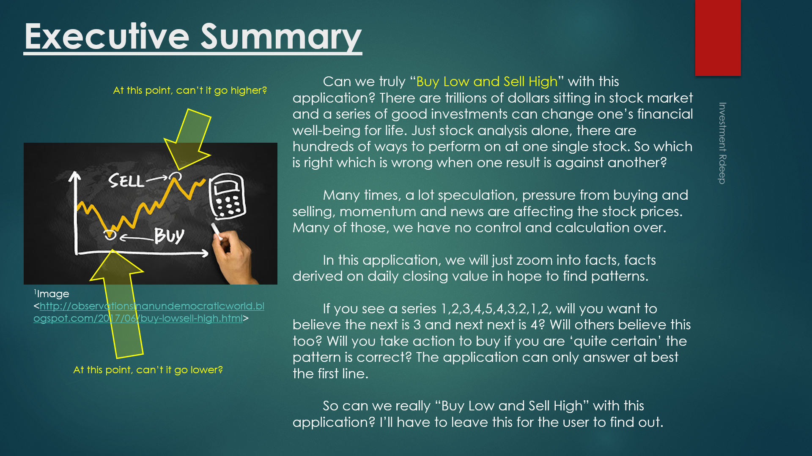

## SECTION 1 : PROJECT TITLE
## Investment Rdeep - Stock Recommender

---

## SECTION 2 : EXECUTIVE SUMMARY

---

## SECTION 3 : CREDITS / PROJECT CONTRIBUTION

| Official Full Name  | Student ID (MTech Applicable)  | Work Items (Who Did What) | Email (Optional) |
| :------------ |:---------------:| :-----| :-----|
| Chng Yan Hao | A0024023A | from 0% to 100% | E0529228@u.nus.edu |

---

## SECTION 4 : VIDEO OF SYSTEM MODELLING & USE CASE DEMO

- View [Project Presentation](https://youtu.be/4J2GSWl8D3I)

---

## SECTION 5 : USER GUIDE

`Refer to appendix`[QuickUserGuide](https://github.com/RyanChngYanHao/PRS-PT-2020-06-20-ISY5002-GRP3-Investment_Rdeep/blob/master/ProjectReport/QuickUserGuide.pdf) `in Github Folder: ProjectReport`

### Able to run standalone:

- download .zip from SystemCodes and unzip
- begin by running ird.bat (Windows OS) or python GUI.py (Mac OS)

### Recommended: 
- Internet connection (for data download)
- Windows 10
- Python 3.7.6
- tensorflow 1.13.2 / tensorflow.keras
- Packages
#####     >>GUI 			: tkinter
#####     >>Data and system related 	: os, sys, sqlite3, importlib, datetime
#####     >>Numbers 			: pandas, numpy
#####     >>Plots and Images 		: matplotlib, PIL
#####     >>Stats related		: sklearn, scipy, statsmodels
#####     >>Sound			: gtts, getpass, playsound

---
## SECTION 6 : PROJECT REPORT / PAPER

`Refer to`[ProjectReport](https://github.com/RyanChngYanHao/PRS-PT-2020-06-20-ISY5002-GRP3-Investment_Rdeep/blob/master/ProjectReport/ProjectReport.pdf) `in Github Folder: ProjectReport`

**Recommended Sections for Project Report / Paper:**
- Executive Summary
- Business Problem Background
- Project Objectives
- Project Solution
- Project Implementation
- Project Performance & Validation
- Project Conclusions: Findings & Recommendation

---
## SECTION 7 : MISCELLANEOUS

`Refer to Github Folder: Miscellaneous`

- InvestmentRdeep.png
- ExecutiveSummary.png
- references.txt

---

**This [Pattern Recognition (PR)](https://www.iss.nus.edu.sg/executive-education/course/detail/machine-reasoning "Pattern Recognition") course is part of the Analytics and Intelligent Systems:** 
**Graduate Certificate in [Pattern Recognition Systems (IRS)](https://www.iss.nus.edu.sg/stackable-certificate-programmes/intelligent-systems "Intelligent Reasoning Systems") series offered by [NUS-ISS](https://www.iss.nus.edu.sg "Institute of Systems Science, National University of Singapore").**

**Special thanks to all lecturers for imparting knowledge in ISY5002 , making this possible.**
